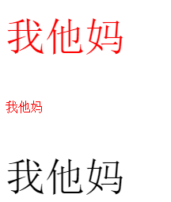

## 1.CSS选择器

- ### 元素选择器：

```css
p{
    color:red;
}
```

- ### id选择器：

```css
#p1{
     color:red;
}
```

- ### class选择器：

```css
.p1{
    color:red;
}
```

**注意：**一个元素可以给他多个class,这样就可以灵活去组合了。例如：

```html
<p class="col size">我他妈</p><!-- class之间用空格隔开 -->
<p class="col">我他妈</p>
<p class="size">我他妈</p>
```

```css
.col{
				color: red;
			}
.size{
				font-size: 50px;
			}
```

结果：



- ### 通配选择器：

```css
*{
    color:red;
}
```

- ### 复合选择器：

  - 交集选择器：

    作用：选中同时符合多个条件的元素

    语法：选择器1选择器2选择器3...(连着写就行了)

    注意：如果其中有元素选择器，则必须以元素选择器开头

    ```css
    div.red{
        color:red;
    }
    ```

  - 并集选择器：
    作用：同时选择多个选择器对应的元素

    语法：选择器1,选择器2,选择器3....

    ```css
    h1,span{
        color:red;
    }
    ```

- ### 属性选择器：

  语法：
    元素名[属性名]	选择含有指定属性的元素
    元素名[属性名=属性值]	选择含有指定属性和属性值的元素
    元素名[属性名^=属性值]	选择属性值以指定值开头的元素
    元素名[属性名$=属性值]	选择属性值以指定值结尾的元素
    元素名[属性名*=属性值]	选择属性值中含有某值的元素

  ```html
  <p title="abc">
      第一行
  </p>
  <p title="helloabc">
      第二行
  </p>
  <p title="qweabcqwe">
      第三行
  </p>
  ```

  ```css
  p[title]{
      color:red;
  }
  p[title=abc]{}
  
  ......
  ```

- ### 伪类选择器和伪元素选择器

  ```css
  span:first-child		伪类选择器，表示span的第一个子元素
  span::first-letter      伪元素选择器，表示span的内容的第一个字
  ```

  从上面的例子可以看出，伪类选择器之所以叫伪类选择器，因为他的效果就像这样，就好像给子标签建了个class一样：

  ```html
  <span>
  	<p class="first">
      第一个
      </p>
      <p>
      第二个
      </p>
  </span>
  ```

  伪元素也一样，就相当于，给这个元素中又建了个元素：

  ```html
  <span>
  	<span  style="font-size:50px;">第</span>一个字放大
  </span>
  ```

  


