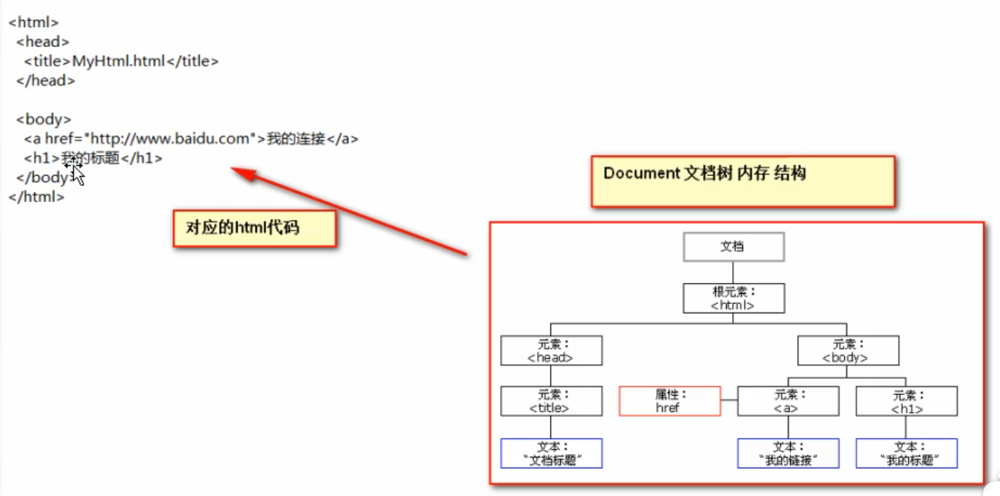

## 1.变量

#### 1.1 变量类型：

- 数值类型：number
- 字符串类型：string
- 对象类型：object
- 布尔类型：boolean
- 函数类型：function

#### 1.2J S中的特殊值：

|           |                                                  |
| --------- | ------------------------------------------------ |
| undefined | 未定义，所有js变量未赋初始值的时候，默认值都是它 |
| null      | 空值                                             |
| NAN       | 全称：Not a Number。非数值。                     |

```javascript
var i=12;
alert(typeof(i));//number

var a=12;
var b="abc";
alert(a*b);//NaN 非数字，非数值
```

#### 1.3 关系运算

等于：==                    简单的字面值比较（12==”12“，结果为true）

全等于：===			  不但字面值比较，还有两个变量的数据类型，（12===”12“，结果为false）

## 2.数组（重点！）

#### 2.1 数组的定义

var 数组名 = [];  //空数组

var 数组名 = [1,'abc',true];

和java中的声明数组还是有区别的：

```java
public static void main(String[] args){

        /**
         * 1. 固定大小的空数组, 动态创建(new的话必须固定长度，因为要在堆中开辟内存)
         */
        String[] strArr1 = new String[3];

        /**
         * 2. 创建数组并直接赋值, 动态创建
         */
        String[] strArr2 = new String[]{"data", "struct", "static"};

        /**
         * 3. 直接赋值数组, 静态创建
         */
        String[] strArr3 = {"public", "private", "protected"};
    }
```

#### 2.2 遍历和扩容

```javascript
var arr = [];  //空数组
arr[2]=true;//只要通过数组下标赋值，那么最大的下标值，就会自动给数组阔容（java直接报错）
for(var i=0;i<arr.length;i++){
    alert(arr[i]);
}
```


## 3.函数（重点！）

#### 3.1 三种函数及其调用方法

```javascript
function f1() {
    alert("无参方法");
}
function f2(a,b) {
    alert("有参方法：a="+a+";b="+b);
}
function f3(a,b) {
    return a+b;
}
f1();
f2(123,"aab");
alert(f3(100,50));
```

#### 3.2 第二种函数声明方式：

var 函数名=function(形参列表){函数体}

**ps：**js中不允许有重载，同名的函数后面就吧前面的覆盖了

#### 3.3 隐形参数

js中虽然声明了参数个数，你还是可以给他随便赋值，并可以通过arguments数组来调用它们

```javascript
function fun(a) {
            alert( arguments.length );//可看参数个数

            alert( arguments[0] );//1
            alert( arguments[1] );//ad
            alert( arguments[2] );//true

            alert("a = " + a);//1

            for (var i = 0; i < arguments.length; i++){
                alert( arguments[i] );
            }
        }
         fun(1,"ad",true);
```

## 4.事件

#### 4.1 常用的事件

| 事件     | 名称             | 功能                                           |
| -------- | ---------------- | ---------------------------------------------- |
| onload   | 加载完成事件     | 页面加载完成之后，常用于做页面js代码初始化操作 |
| onclick  | 单击事件         | 常用于按钮点击响应                             |
| onblur   | 失去焦点事件     | 常用于输入框失去焦点后验证其输入内容是否合法   |
| onchange | 内容发生改变事件 | 常用于下来列表和输入框内容发生改变后操作       |
| onsubmit | 表单提交时间     | 常用于表单提交前，验证所有表单项是否合法。     |

#### 4.2 事件的注册（绑定）

静态注册事件：

```html
<head>
    <meta charset="UTF-8">
    <title>Title</title>
    <script type="text/javascript">
        function onloadFun() {
            alert("静态注册onload事件");
        }
        function onclickFun(){
            alert("静态注册onclick事件");
        }
    </script>
</head>

<body onload="onloadFun();">
<span>这是第二个span
        </span>
    <button onclick="onclickFun()">按钮1</button>
</body>
</html>
```

动态注册事件：

```javascript
window.onload = function () {
    alert("动态态注册onload事件是固定写法");
    //动态态注册onclick事件要写在onload方法中，分为两步
    //1.获取元素对象
    var btn2 = document.getElementById("btn2");
           
    //2.通过对象名.事件名称 = function(){}赋值
     btn2.onclick = function () {
                alert("动态态注册onclick事件");
            }
}

```

onsubmit比较特殊：

```html
<!DOCTYPE html>
<html lang="en">
<head>
    <meta charset="UTF-8">
    <title>Title</title>
    <script type="text/javascript">
        function onsubmitFun() {
            alert("准备提交");
           // return false;
        }
        window.onload = function () {
            var form3=document.getElementById("form3");
            form3.onsubmit = function () {
                alert("动态注册准备提交");
                return false;//阻止元素的默认行为
            }
        }
    </script>
</head>
<body>
    <!--要想阻止提交，需要onsubmit="return false;" -->
<form action="http://localhost:8080" onsubmit="return false;">
    <input type="submit" value="第一种静态注册">
</form>
    <!--在函数中判断是否符合提交条件，不符合则return false，false被return到onsubmit属性中，相当于 onsubmit="false" ,少了return，所以必须在调用时函数名前加上return-->

<form action="http://localhost:8080" onsubmit="return onsubmitFun()">
    <input type="submit" value="第二种静态注册">
</form>
<form id = "form3" action="http://localhost:8080" >
    <input type="submit" value="动态注册">
</form>
</body>
</html>
```

## 5.Document对象

当前html文档的对象



- Document它管理了所有html文档内容
- document它是一种树结构的文档，它有层级关系
- 它让我们把所有标签都对象化
- 我们可以通过document对象访问所有的标签对象

+