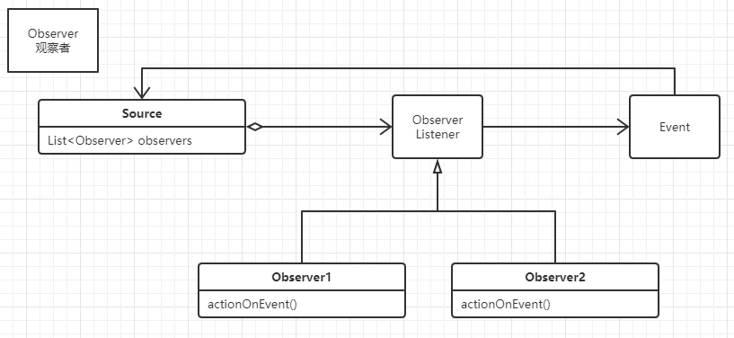

## 观察者模式

用于监听一个对象的一些行为，其它对象会针对这个行为做出自己的反应。

### 举例：

​		宝宝在睡觉，醒了会哭，其他人关注宝宝，哭了会做相应的处理。

#### demo1：

如果不使用观察者思想，那就是其他人一直观察宝宝，直到宝宝醒来，然后再做处理：

```java
package com.ljj.demo1;

import java.util.Random;

public class main {
    public static void main(String[] args) throws InterruptedException {
        Child child = new Child();
        //创建爸爸对象,需要把孩子对象聚合进去，并一直查看其状态
        Dad dad = new Dad(child);
        //创建妈妈对象
        Mum mum = new Mum(child);
        //整两个线程，就是爸爸和妈妈，都来监视这个娃
        Thread thread1 = new Thread(new Runnable() {

            @Override
            public void run() {
                try {
                    dad.watch();
                } catch (InterruptedException e) {
                    e.printStackTrace();
                }
            }
        });
        Thread thread2 = new Thread(new Runnable() {
            @Override
            public void run() {
                try {
                    mum.watch();
                } catch (InterruptedException e) {
                    e.printStackTrace();
                }
            }
        });
        thread1.start();
        thread2.start();
        //娃的睡觉时长
        int i = new Random().nextInt(10)*500+3000;
        System.out.println(i);
        Thread.sleep(i);
        //睡了一个随机数以后，醒了
        child.setStatus("wakeup");
    }

}
```

```java
//宝宝类
class Child {
    //娃的状态，一开始在睡觉
    private String status = "sleep";

    public String getStatus() {
        return status;
    }

    public void setStatus(String status) {
        this.status = status;
    }
}

```

```java
/**
 * 爸爸
 */
class Dad{
    //聚合了娃
    private Child child;
    Dad(Child c){
        this.child=c;
    }
    
    
    public void watch() throws InterruptedException {
        while (child.getStatus()=="sleep"){
            System.out.println("爸爸在看，宝宝在睡觉。。。");
            Thread.sleep(1000);
        }
         hit();
    }
    private void hit(){
        System.out.println("宝宝哭了，快打他。。。。");
    }
}

/**
 * 妈妈
 */
class Mum{
    Mum(Child c){
        this.child=c;
    }
    private Child child;
    public void watch() throws InterruptedException {
        while (child.getStatus()=="sleep"){
            System.out.println("妈妈在看，宝宝在睡觉。。。");
            Thread.sleep(1700);
        }
        hug();
    }
    private void hug(){
        System.out.println("宝宝哭了，快抱抱他。。。。");
    }
}
```

这个做法简直反人类，大家都啥事不干观察着宝宝，而且每个人都聚合了宝宝对象，耦合性很高。

#### demo2：

换成宝宝对象去聚合其他人，醒了给他们提醒。

```java
/**
 * 将父母组合进娃对象里
 */
public class Child {
    private Dad dad=new Dad();
    private Mum mum=new Mum();
    public void wakeUp() {
        dad.doSomething();
        mum.doSomething();
    }
}
```

这样做好处就是爸妈可以干自己的事情了，娃醒了自己会调用父母的doSomething方法。

```java
public class Dad {
    public void doSomething()  {
       {
            System.out.println("爸爸在看，宝宝在睡觉。。。");
        }
        hit();
    }
    private void hit(){
        System.out.println("宝宝哭了，快打他。。。。");
    }

}
```

```java
package com.ljj.demo2;

public class Mum {
    public void doSomething()  {
        {
            System.out.println("妈妈在看，宝宝在睡觉。。。");
        }
        hug();
    }
    private void hug(){
        System.out.println("宝宝哭了，快抱抱他。。。。");
    }
}
```

这样做的缺点也是显而易见：组合的方式耦合性太高，而且每有一个新观察者就要改宝宝类，违反ocp原则。

#### demo3：

大家都实现一个观察者接口，然后在宝宝类里创建一个观察者类型的List，这样既降低了代码的耦合，又不用违反开闭原则。

```java
/**
 * 把所有Observer放进list中，再提供add和remove方法
 */
public class Child {
    private ArrayList<Observer> observerList = new ArrayList();

    /**
     * 宝宝醒了，就遍历一下观察者list，把所有人都叫一下
     */
    public void wakeUp() {
        for (Observer observer : observerList) {
            observer.doSomething();
        }
    }
    public void addObserver(Observer observer){
        observerList.add(observer);
    }
    public void removeObservers(Observer observer){
        observerList.remove(observer);
    }

}
```

```java
public interface Observer {
    void doSomething();
}
//爸爸实现Observer接口，妈妈也是，就省略了
public class Dad implements Observer{
    public void doSomething()  {
       {
            System.out.println("爸爸在看，宝宝在睡觉。。。");
        }
        hit();
    }
    private void hit(){
        System.out.println("宝宝哭了，快打他。。。。");
    }

}
```

```java
public class main {
    public static void main(String[] args) {
        Child child = new Child();
        child.addObserver(new Dad());
        child.addObserver(new Mum());
        child.wakeUp();
    }
}
```

这样基本就是一个成熟的观察者模式了。但是在实际应用中或者spring源码中，应用的时候还是会将事件源（宝宝）和行为（醒了哭）分别抽象出来。

#### demo4：

将宝宝和醒了抽象成事件源和事件本身两个类，也就是Source和Event，Event中封装了这个事件相关的一些信息，比如宝宝醒的时间，哭的声音大小，哭的地点等。Source创建出这个Event对象后传给Observer，Observer就可以根据Event中的信息做相应的处理。

关系图如下，这就是观察者模式的最终形态：



实例代码如下：

​	调用方法不变，注册观察者就完事了。

```java
public class main {
    public static void main(String[] args) {
        Child child = new Child();
        child.addObserver(new Dad());
        child.addObserver(new Mum());
        child.wakeUp();
    }
}
```

事件类的代码：

```java
/**
 * 醒了这个事件的对象,这里将这个事件抽象出来单独作一个类。
 *  如果有多个事件，也可以抽象出父类Event，这样观察者们就可以观察多种事件了
 */
public class WakeUpEvent {
    //醒的时间
    long time;
    //醒的地点（床上，地上？）
    String loc;
    //哭的声音大小
    String voice;
    //事件源对象，本例中只涉及一个源，多个的时候可以创建并声明为Source类型，Child继承Source即可
    Child Source;

    public WakeUpEvent(long time, String loc,String voice,Child source) {
        this.time = time;
        this.loc = loc;
        this.voice = voice;
        this.Source = source;
    }

    public Child getSource() {
        return Source;
    }
}
```

被观察者的代码：

```java

/**
 * 当然事件源类也可以抽象出它的父类Source，这样Event封装事件源的时候就可以封装多种事件源啦
 */
public class Child {
    private ArrayList<Observer> observerList = new ArrayList();


    public void wakeUp() {
        //创建事件对象，把一些相关信息放进去
        WakeUpEvent wakeUpEvent = new WakeUpEvent(System.currentTimeMillis(),"bed","loud",this);
        for (Observer observer : observerList) {
            //由Source创建Event对象，并传给观察者
            observer.doSomething(wakeUpEvent);
        }
    }
    public void addObserver(Observer observer){
        observerList.add(observer);
    }
    public void removeObservers(Observer observer){
        observerList.remove(observer);
    }

}
```

观察者拿到Source给的Event对象，然后做相应的处理

```java
public interface Observer {
    void doSomething(WakeUpEvent wakeUpEvent);
}

public class Mum implements Observer {
    public void doSomething(WakeUpEvent wakeUpEvent)  {

            System.out.println("宝宝哭声"+wakeUpEvent.voice);

        hug();
    }
    private void hug(){
        System.out.println("宝宝哭了，快抱抱他。。。。");
    }
}
```

完结撒花~~~